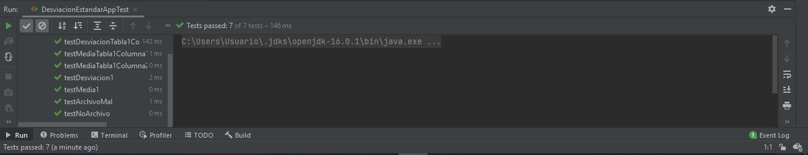

# TALLER DE ANALISIS Y DIEÑO DE SISTEMAS OO

Este programa calcula la desviacion estandar y la media de n numeros tomados de un archivo.

### Prerrequisitos

Los pasos a continuación permiten clonar el programa en su computador.


Eston son los requisitos que software que tienen que estar instalados previamente:

```
Maven
```
```
Git
```
```
JAVA
```

## Construcción 
* [Maven](https://maven.apache.org/) - Dependencias de maven

## Autores

* **BRAYAN ALEXIS JIMÉNEZ MOYA** 

## LOC

	250 lineas en 10 horas
	25 lineas codigo por hora

## PRUEBAS
  


## Javadoc

* El javadoc se genero gracias a la herramienta de IntelliJ IDEA
	
## Licencia

En este proyecto se usó la licencia GNU - se puede ver [LICENSE](LICENSE) para más detalles.


